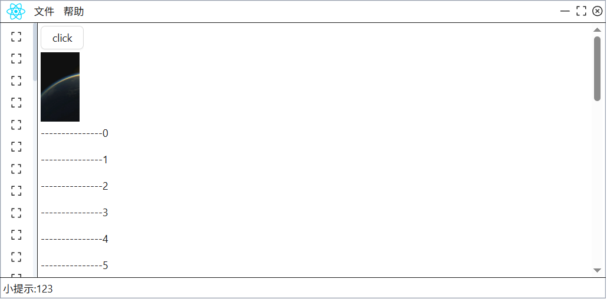

# AutoHotKey-WebView2-React

使用 React 编写 AHK 界面



## Get started

克隆这个仓库 或 下载 zip

运行 JS 代码

```bash
pnpm install
pnpm run dev
```

使用 [thqby.vscode-autohotkey2-lsp](https://marketplace.visualstudio.com/items?itemName=thqby.vscode-autohotkey2-lsp) 运行/调试 ahk 代码

打包

```bash
pnpm run build
```

最终的 exe 程序生成在 `out` 目录, exe 的大小只有 2 MB

## Code

### 访问本地文件

在 web 中直接使用 `http://` 前缀, 也可以调用 ahk 函数返回给 web

```html

```

```js
// let filePath = "C:/Users/admin/Desktop/test_utf16.txt";
const filePath = "C:/Users/admin/Desktop/test_gb2312.txt";

// fetch 支持 byte string json 等
const result = await fetch(`http://${filePath}`)
  .then(r => r.arrayBuffer())
  .then((r) => {
    // let d = new TextDecoder("UTF-16");
    const d = new TextDecoder("gb2312");
    return d.decode(r);
  });
```

### js 调用 ahk 函数

使用 `scripts/gen-ahk-fn-wrapper.ts` 脚本,

生成到 `src-runtime/generate-out/ahk-fn-wrapper-gen.ts`,

在 js 中直接导入 (适合多次调用的函数)

```typescript
import { FileRead } from "@src-runtime/generate-out/ahk-fn-wrapper-gen";

const p = String.raw`D:\Work\CppProject\AutoHotkey-alpha\README.md`;
const r = await FileRead(p, "UTF-8");
```

或者使用 `invokeFn`,

可以传参并获取返回值 (适合一次性调用的函数, 比如 业务逻辑)

```typescript
const r = await invokeFn("test_fn", p, "123");
```

### ahk 调用 js

使用 `exec_js(...)` 传参并获取返回值,

js 中的函数需要挂到 window 上 `window.fn_name = (args) => { }`

### CSS 相关

简单的使用 Tailwindcss 去写, 复杂的使用 SCSS 写, 两者互补, 方便维护,

既解决了 Tailwindcss 写的过长难以维护, 又解决了 SCSS 每次都要取名的烦恼

## 更换前端框架

所有通用的代码都在 src-runtime 中,

只需要修改 vite.config.ts 中的 react 插件 和 src 中的代码

## Packages

[thqby/ahk2_lib](https://github.com/thqby/ahk2_lib)

[The-CoDingman/WebViewToo](https://github.com/The-CoDingman/WebViewToo)

[Nigh/AHK-webview-template](https://github.com/Nigh/AHK-webview-template)

## Note

对 `src-runtime/ahk-lib/WebViewToo/WebViewToo.ahk` 进行了修改, 原作者太久没有合并 PR
